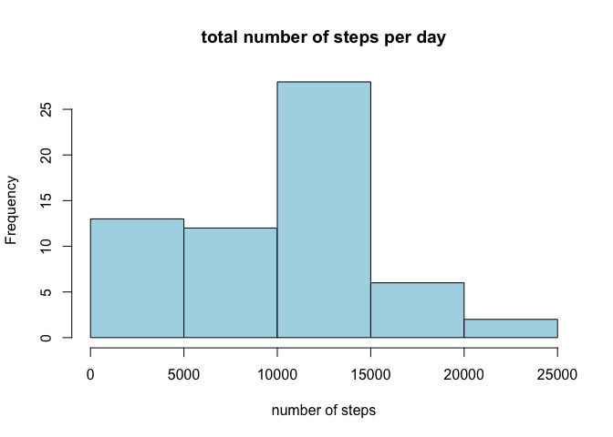
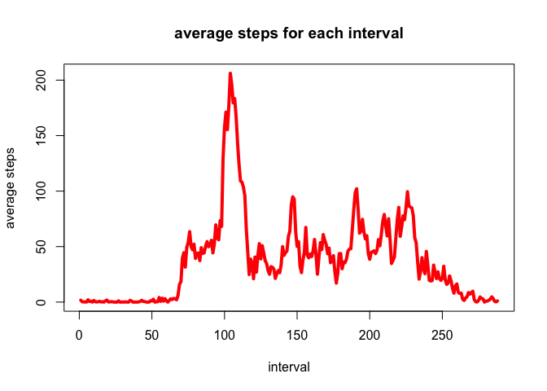
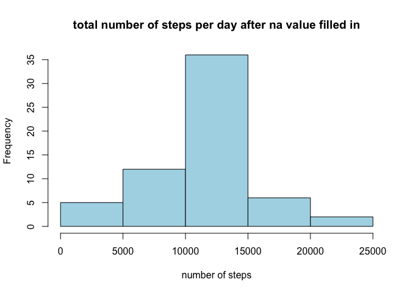
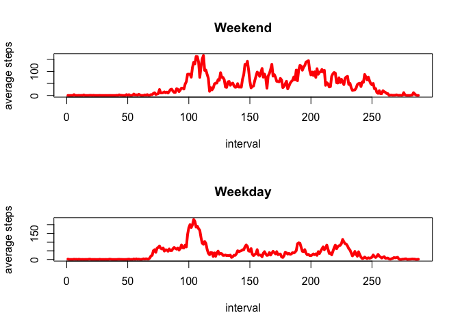

## Loading and preprocessing the data

First, load the data, and also quickly check out the data

``` r
activity_data <- read.csv("activity.csv")
str(activity_data)
```

```
## 'data.frame':	17568 obs. of  3 variables:
##  $ steps   : int  NA NA NA NA NA NA NA NA NA NA ...
##  $ date    : chr  "2012-10-01" "2012-10-01" "2012-10-01" "2012-10-01" ...
##  $ interval: int  0 5 10 15 20 25 30 35 40 45 ...
```

After viewing the types of variable, and in order to calculate total number of 
steps taken per day, we need to first convert the date into date format instead 
of character format. Then we need to calculate the sum of steps for each day, 
which is the total number of steps taken per day.


``` r
activity_data$date <- as.Date(activity_data$date, format = "%Y-%m-%d")
# then use dplyr function group steps based on dates and calculate sum of steps
# for each date
library(dplyr)
```

```
## 
## Attaching package: 'dplyr'
```

```
## The following objects are masked from 'package:stats':
## 
##     filter, lag
```

```
## The following objects are masked from 'package:base':
## 
##     intersect, setdiff, setequal, union
```

``` r
tot_step_pday <- activity_data %>%
  group_by(date) %>%
  summarise(total_steps = sum(steps, na.rm=TRUE))
# view the total steps per day
str(tot_step_pday)
```

```
## tibble [61 × 2] (S3: tbl_df/tbl/data.frame)
##  $ date       : Date[1:61], format: "2012-10-01" "2012-10-02" ...
##  $ total_steps: int [1:61] 0 126 11352 12116 13294 15420 11015 0 12811 9900 ...
```

Make a histogram of the total number of steps taken each day

``` r
hist(tot_step_pday$total_steps,
     main = "total number of steps per day",
     xlab = "number of steps",
     ylab = "Frequency",
     col = "lightblue",
     border = "black")
```

<!-- -->

## What is mean total number of steps taken per day?

Calculate and report the mean and median of the total number of steps taken per day

``` r
tot_step_mean <- mean(tot_step_pday$total_steps)
tot_step_med <- median(tot_step_pday$total_steps)
cat("Mean of the total number of steps taken per day is: ", tot_step_mean, "\n")
```

```
## Mean of the total number of steps taken per day is:  9354.23
```

``` r
cat("Median of the total number of steps taken per day is: ", tot_step_med, "\n")
```

```
## Median of the total number of steps taken per day is:  10395
```

## What is the average daily activity pattern?

- Make a time series plot (i.e. type = "l") of the 5-minute interval (x-axis) and the average number of steps taken, averaged across all days (y-axis)

Coding process: first, turn interval variable into factor, then calculate mean number of steps for each interval (account for all days measured). Then plot interval (x-axis) and the mean number of steps for each interval.


``` r
library(dplyr)
# first extract interval id and use it as x-axis
interval_id <- unique(activity_data$interval)
# turn interval variable from int to factor
activity_data$interval <- as.factor(activity_data$interval)
mean_step_interval <- activity_data %>%
  group_by(interval) %>%
  summarise(mean_steps = mean(steps, na.rm = TRUE))
# look at the new data frame
str(mean_step_interval)
```

```
## tibble [288 × 2] (S3: tbl_df/tbl/data.frame)
##  $ interval  : Factor w/ 288 levels "0","5","10","15",..: 1 2 3 4 5 6 7 8 9 10 ...
##  $ mean_steps: num [1:288] 1.717 0.3396 0.1321 0.1509 0.0755 ...
```

Then make a plot of the average daily activity pattern.


``` r
plot(as.numeric(unique(activity_data$interval)), mean_step_interval$mean_steps,
     type = "l",
     col = "red",
     lwd = 4,
     xlab = "interval",
     ylab = "average steps",
     main = "average steps for each interval")
```

<!-- -->

- Which 5-minute interval, on average across all the days in the dataset, contains the maximum number of steps?

The answer for this question is based on the plot generated from the previous question.

But coding-wise, we can use which.max to find the index for max average steps and print how the corresponding row.


``` r
max_step_index <- which.max(mean_step_interval$mean_steps)
max_step_row <- mean_step_interval[max_step_index, ]
cat("On average across all the days, the 5-minute interval that contains maximum steps is: ", as.numeric(max_step_row$interval))
```

```
## On average across all the days, the 5-minute interval that contains maximum steps is:  104
```

## Imputing missing values

- Calculate and report the total number of missing values in the dataset (i.e. the total number of rows with NAs)

Coding process: use sum() and is.na() functions.


``` r
total_na <- sum(is.na(activity_data))
cat("total numer of missing values in the dataset is: ", total_na)
```

```
## total numer of missing values in the dataset is:  2304
```

- Devise a strategy for filling in all of the missing values in the dataset. The strategy does not need to be sophisticated. For example, you could use the mean/median for that day, or the mean for that 5-minute interval, etc.

I am going to use the mean for that 5-minute interval to fill in all the missing values.

- Create a new dataset that is equal to the original dataset but with the missing data filled in.

Coding process: use tapply() function to calculate the mean number of steps for each interval, then use sapply to replace na values using the mean steps for each interval.


``` r
mean_steps_interval <- tapply(activity_data$steps, activity_data$interval, function(x) mean(x, na.rm=TRUE))
activity_data$steps[is.na(activity_data$steps)] <- sapply(activity_data$interval[is.na(activity_data$steps)], function(x) mean_steps_interval[as.character(x)])
# view the changed dataset
str(activity_data)
```

```
## 'data.frame':	17568 obs. of  3 variables:
##  $ steps   : num  1.717 0.3396 0.1321 0.1509 0.0755 ...
##  $ date    : Date, format: "2012-10-01" "2012-10-01" ...
##  $ interval: Factor w/ 288 levels "0","5","10","15",..: 1 2 3 4 5 6 7 8 9 10 ...
```

- Make a histogram of the total number of steps taken each day and Calculate and report the mean and median total number of steps taken per day. Do these values differ from the estimates from the first part of the assignment? What is the impact of imputing missing data on the estimates of the total daily number of steps?

Coding process: similar to the first question.


``` r
library(dplyr)
tot_step_pday <- activity_data %>%
  group_by(date) %>%
  summarise(total_steps = sum(steps, na.rm=TRUE))
```

Then make a histogram.


``` r
hist(tot_step_pday$total_steps,
     main = "total number of steps per day after na value filled in",
     xlab = "number of steps",
     ylab = "Frequency",
     col = "lightblue",
     border = "black")
```

<!-- -->

Finally calculate and report the mean and median of the total number of steps taken per day after na values filled in.

``` r
tot_step_mean <- mean(tot_step_pday$total_steps)
tot_step_med <- median(tot_step_pday$total_steps)
cat("Mean of the total number of steps taken per day is: ", tot_step_mean, "\n")
```

```
## Mean of the total number of steps taken per day is:  10766.19
```

``` r
cat("Median of the total number of steps taken per day is: ", tot_step_med, "\n")
```

```
## Median of the total number of steps taken per day is:  10766.19
```

The mean and median values both increased after I filled in the na values. From histogram, we can see that replacing na values with average steps for each interval, the frequency of the total number of steps in the middle ("average total number of steps") increased.

## Are there differences in activity patterns between weekdays and weekends?

- Create a new factor variable in the dataset with two levels – “weekday” and “weekend” indicating whether a given date is a weekday or weekend day.

Coding process: use the weekdays() function to identify which weekday and if Saturday and Sunday we add factor "weekend" and other we add factor "weekday"


``` r
is_weekend <- activity_data$date %>% as.character() %>% sapply(function(x) weekdays(as.Date(x)) %in% c("Saturday", "Sunday"))

activity_data$DayType <- factor(ifelse(is_weekend,"weekend", "weekday"), levels = c("weekday", "weekend"))

# view the updated dataset
str(activity_data)
```

```
## 'data.frame':	17568 obs. of  4 variables:
##  $ steps   : num  1.717 0.3396 0.1321 0.1509 0.0755 ...
##  $ date    : Date, format: "2012-10-01" "2012-10-01" ...
##  $ interval: Factor w/ 288 levels "0","5","10","15",..: 1 2 3 4 5 6 7 8 9 10 ...
##  $ DayType : Factor w/ 2 levels "weekday","weekend": 1 1 1 1 1 1 1 1 1 1 ...
```

- Make a panel plot containing a time series plot (i.e. type = "l") of the 5-minute interval (x-axis) and the average number of steps taken, averaged across all weekday days or weekend days (y-axis).

Coding process: First get subset for only weekend and also only weekday. Then for each subset, plot time series plot.


``` r
activity_data_weekend <- subset(activity_data, DayType == "weekend")
activity_data_weekday <- subset(activity_data, DayType == "weekday")
```

For each day type, first, turn interval variable into factor, then calculate mean number of steps for each interval (account for all days measured). Then plot interval (x-axis) and the mean number of steps for each interval.


``` r
library(dplyr)
# First, weekend dataset
# turn interval variable from int to factor
activity_data_weekend$interval <- as.factor(activity_data_weekend$interval)
mean_step_interval_weekend <- activity_data_weekend %>%
  group_by(interval) %>%
  summarise(mean_steps = mean(steps, na.rm = TRUE))

# Second, weekday dataset
activity_data_weekday$interval <- as.factor(activity_data_weekday$interval)
mean_step_interval_weekday <- activity_data_weekday %>%
  group_by(interval) %>%
  summarise(mean_steps = mean(steps, na.rm = TRUE))
```

Then make a panel plot of the average daily activity pattern containing both weekday and weekend data.


``` r
par(mfrow=c(2,1))
plot(as.numeric(unique(activity_data$interval)), mean_step_interval_weekend$mean_steps,
     type = "l",
     col = "red",
     lwd = 4,
     xlab = "interval",
     ylab = "average steps",
     main = "Weekend")

plot(as.numeric(unique(activity_data$interval)), mean_step_interval_weekday$mean_steps,
     type = "l",
     col = "red",
     lwd = 4,
     xlab = "interval",
     ylab = "average steps",
     main = "Weekday")
```

<!-- -->

